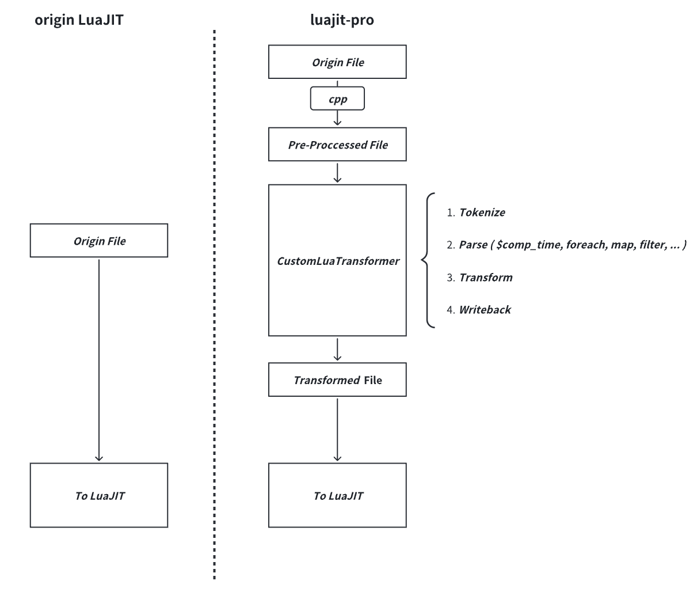

# luajit-pro

`luajit-pro` is a LuaJIT fork with some extra syntax. It is based on [the openresty fork of LuaJIT 2.1.0.](https://github.com/openresty/luajit2)

We add an extra syntax transformer on the `lj_load.c` which contains the entry point of the file loader and string loader of LuaJIT. So the original file will be passed into our custom syntax transformer first and the custom syntax will be tansformed into Lua code which can be further parsed and compiled by LuaJIT later(see [lj_load_helper.cpp](patch/src/lj_load_helper.cpp/) for the detailed implementaion).



## Features
`luajit-pro` adds some extra syntax/feature to LuaJIT, such as:
  - C/C++ like `preprocess` using `cpp` command. (make sure that `cpp` command is available and exist on your `PATH`)
  - Implement `metaprogramming` using internal Lua virtual machine.
  - Functional operators `foreach`, `map`, `filter`, `zipWithIndex` for Lua table, which is inspired by `Scala`.

## Install
To install `luajit-pro`, you simply need to execute the following command in your terminal:
```bash
bash init.sh
```
The default install path is the [luajit2 path](luajit2) itself. You can change the install path by setting the `install_dir` in [install_luajit.sh](install_luajit.sh).

## Examples
To enable the extra syntax, we need to add a directive(i.e. `"--[[verilua]]"`) to the Lua code file at fist line.
```Lua
--[[verilua]]

--
-- Other codes...
--
```
### Preprocess
```Lua
---[[verilua]]

#define PRINT(X) print(__LINE__, X)

PRINT("HELLO")

#ifdef SOME_MACRO
    print("SOME_MACRO is defined!")
#else
    print("SOME_MACRO is not defined!")
#endif

#include "some_outer_file.lua"

```

### Metaprogramming
The metaprogramming code block is started with `$comp_time` and the content is inside the `{}`. The code inside the block will be executed at compile time and the result will be inserted into the original code.

```Lua
---[[verilua]]

$comp_time {
    f = string.format
    s = ""
    for i = 1, 3 do
        s = s .. f("print(\"from $comp_time\", %d)", i) .. "\n"
    end
    return s -- To successfully insert the generated code, make sure that the generated code is a string and return it.
}
```

The generated code is:
```Lua
print("from $comp_time", 1)
print("from $comp_time", 2)
print("from $comp_time", 3)
```

### Functional operators
> Notice that the commented codes below the extra syntax codes are the actual generated Lua codes.
#### foreach
```Lua
local tbl = {1, 2, 3}

tbl.foreach{ x => 
    local tmp = "tmp"
    print(x, tmp)
}
-- for _, x in ipairs(tbl) do 
--     local tmp = "tmp"
--     print(x, tmp)
-- end

tbl.foreach{print}
-- for _, ref in ipairs(tbl) do print(ref) end


tbl.zipWithIndex.foreach{ (i, x) => 
    print(i, x)
}
-- for i, x in ipairs(tbl) do 
--     print(i, x)
-- end

tbl.foreach.zipWithIndex{ (x, i) =>
    print(i, x)
}
-- for i, x in ipairs(tbl) do 
--     print(i, x)
-- end
```
#### map
```Lua
local tbl = {1, 2, 3}

local result = tbl.map{ x => 
    local tmp = "tmp"
    return tostring(x) .. tmp
}
-- local result = {}; for _, x in ipairs(tbl) do 
--     local tmp = "tmp"
--     _tinsert(result, tostring(x) .. tmp
-- ) end

local function trans(x)
    return x * 2
end

local result2 = tbl.map{trans}
-- local result2 = {}; for _, ref in ipairs(tbl) do _tinsert(result2, trans(ref) ) end

result3 = tbl.zipWithIndex.map{ (i, x) => 
    return i .. x
}
-- result3 = {}; for i, x in ipairs(tbl) do 
--     _tinsert(result3, i .. x
-- ) end

result4 = tbl.map.zipWithIndex{ (x, i) =>
    return i .. x
}
-- result4 = {}; for i, x in ipairs(tbl) do 
--     _tinsert(result4, i .. x
-- ) end
```

#### filter
```Lua
local tbl = {1, 2, 3, 4}

local result = tbl.filter{ x => return x % 2 == 0 }
-- local result = {}; for _, x in ipairs(tbl) do if x % 2 == 0  then _tinsert(result, x) end end

local function filter_func(x)
    return x % 2 == 0
end

local result2 = tbl.filter{filter_func}
-- local result2 = {}; for _, ref in ipairs(tbl) do if filter_func(ref) then _tinsert(result2, ref) end end

result3 = tbl.zipWithIndex.filter{ (i, x) => 
    return i > 2 and x % 2 == 0
}
-- result3 = {}; for i, x in ipairs(tbl) do 
--     if i > 2 and x % 2 == 0
--  then _tinsert(result3, x) end end

result4 = tbl.filter.zipWithIndex{ (x, i) => 
    return i > 2 and x % 2 == 0 
}
-- result4 = {}; for i, x in ipairs(tbl) do 
--     if i > 2 and x % 2 == 0
--  then _tinsert(result4, x) end end

```

## TODO
The code implementation of this repo is too simple and crude, and there is much room for improvement in the future.
  - [ ] Add more functional operators.
  - [ ] Add more metaprogramming features.
  - [ ] Add more preprocess features.
  - [ ] Add more examples.